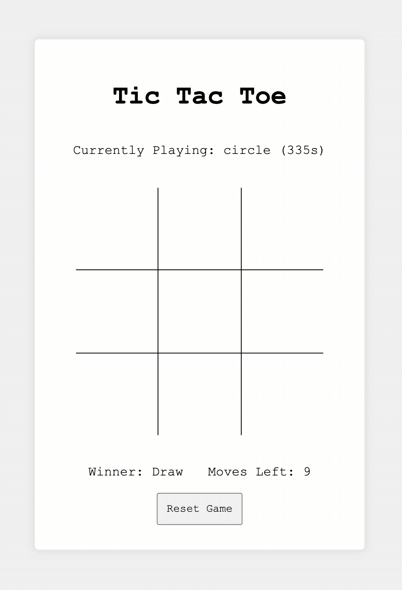

# React by Example: Tic-tac-toe Game

Learn React by doing it.

This repo provides the reference code used by the short tutorial below. [Check out this Codesandbox](https://codesandbox.io/s/react-tic-tac-toe-egbnq?file=/src/index.jsx) to see the game in action along with its source code.

<p align="center">
  
</p>

## Table of Contents

- [What's React](#whats-react)
- [What's a React Component?](#whats-a-react-component)
  - [Stateless Components](#stateful-components)
    - [Basic Component Structure](#basic-component-structure)
    - [Children Elements](#children-elements)
  - [Styling Components](#styling-components)
  - [Thinking in React](#thinking-in-react)
  - [Stateful Components](#stateful-components)
  - [Custom Hooks: Reusable Application Logic](#custom-hooks-reusable-application-logic)
  - [Component Lifecycle](#component-lifecycle)
    - [The Mount Phase](#the-mount-phase)
    - [The Update Phase](#the-update-phase)
    - [The Unmount Phase](#the-unmount-phase)
    - [Hooking Into the Lifecycle](#hooking-into-the-lifecycle)
  - [Accessing Application Data Through Context]()
  - [Optimizations](#optimizations)
    - [Memoizing Callbacks](#memoizing-callbacks)
    - [Memoizing Expensive Computations](#memoizing-expensive-computations)
    - [Preventing Unnecessary Rendering](#prevent-unnecessary-rendering-cycles)
  - [Resources](#resources)

## What's React?

[React](https://reactjs.org/) is A JavaScript library for building user interfaces, it's `declarative` and `component` based.

Developers can simply describe what the UI should look like by creating and composing components together, and React takes care of rendering these components to the target platform (DOM, iOS, Android, Shell, etc...) in the most efficent way possible.

## What's a React Component?

1. The basic building block in the React ecosystem;
2. It's simply a JS function (for the most part 😅);
3. Can optionally receive data via its first argument, known as `props`;
4. Return markup code that looks a lot like HTML, known as `JSX`;
5. Can be stateless or statefull;

## Stateless Components

Stateless components are the simplest form of a React component.They can optionally receive data via `props` and returns JSX code that describes the UI requirements of the component. They do not hold internal state, therefore, stateless components.

This type of component can be treated as a pure function, where given the same input, e.g. `props` we always get the same `JSX` output.

### Basic Component Structure

_/src/index.js_

```jsx
import ReactDOM from "react-dom"

function Greeting(props) {
  return <h1>Hello {props.name}!</h1>
}

ReactDOM.render(<Greeting name="Create 2021.1" />, document.getElementById("root"))
```

As it may already be obivious, the `name` attribute above is accessible within the component's function definition through its `props` argument. This usage will render the following to the DOM:

```html
<h1>Hello Create 2021.1!</h1>
```

### Children Elements

React components can also wrap children elements, which are made accessible via the `props` argument, just like any other regular prop passed to the component. Children elements can be **any** type of React expression, that being built-in tags such as `div` and `p`, a text node, or other components.

Let's imagine a `Card` component that can be used as a container to hold any number of children elements. This is what it could look like:

_/src/index.js_

```jsx
import ReactDOM from "react-dom"

function Card(props) {
  return (
    <div>{props.children}</div>
  )
}

const app = (
  <Card>
    <Greeting name="Alice" />
    {"Look! I'm a text node!}
    <Greeting name="Bob" />
    <p>now with built-in tags...</p>
  </Card>
)

ReactDOM.render(
  app,
  document.getElementById("root"),
)
```

## Styling Components

React Components [can be styled in various ways](https://reactjs.org/docs/faq-styling.html), here're the three most common ones:

1. Declarativelly, with regular CSS by passing class names to the component via the `className` prop;
2. Programatically, by passing a JS object containing CSS properties to thee component via the `style`props;
3. Using [CSS Modules](https://css-tricks.com/css-modules-part-1-need/) to provide CSS code scoped to your component, preventing issues like CSS leaking throughout the app;

Let's see how we'd style our `Greeting` component using all three strategies:

<details><summary>Plain CSS</summary>

_/src/styles.css_

```css
.greeting {
  color: green;
}
```

_/src/index.js_

```jsx
import ReactDOM from "react-dom"

import "./styles.css"

function Greeting(props) {
  return <h1 className="greeting">Hello {props.name}!</h1>
}

ReactDOM.render(<Greeting name="Create 2021.1" />, document.getElementById("root"))
```

</details>

<details><summary>Style Prop</summary>

_/src/index.js_

```jsx
import ReactDOM from "react-dom"

function Greeting(props) {
  const css = { color: "green" }
  return <h1 style={css}>Hello {props.name}!</h1>
}

ReactDOM.render(<Greeting name="Create 2021.1" />, document.getElementById("root"))
```

</details>

<details><summary>CSS Modules</summary>

_/src/styles.module.css_

```css
.greeting {
  color: green;
}
```

_/src/index.js_

```jsx
import ReactDOM from "react-dom"

import styles from "./styles.module.css"

function Greeting(props) {
  return <h1 className={styles.greeting}>Hello {props.name}!</h1>
}

ReactDOM.render(<Greeting name="Create 2021.1" />, document.getElementById("root"))
```

</details>

## Thinking in React

When building apps with React (or any component driven lib for that matter), it is often useful (and a good practice) to break down the UI into simpler abstractions, where each abstraction can be implemented by its own React component and later composed together to form the final result. Think LEGO bricks 👌🏾

Here's one way to break down the Tic-Tac-Toe app into smaller building blocks:

<p align="center">
  
</p>

1. `Game` component: It's the root component of our app, the entrypoint. This is going to be our stateful component, responsible for holding the game state;
2. `Card` component, implements the card container;
3. `Text` component, implements an abstraction of text elements so we can encapsulate app specific styles and reuse throughout the app;
4. `Board` component, implements the Tic-Tac-Toe board;
5. `Cell` component, implements the board cells as buttons that the user can click on in order to make a move;
6. `Button` component, very much like the `Text` component, this one will encapsulate app specific styles and so it can be reused throughout the app;

As you may have noticed, the structure of a React app, very much like the HTML DOM, is a tree. Here's what our Components Tree will look like:

<p align="center">
  
</p>

The [Thinking in React article](https://reactjs.org/docs/thinking-in-react.html) covers this topic in more detail, and it's a must read resource for anyone working with this type of UI development paradigm.

## Stateful Components

As opposed to steteless components, stateful components do hold internal state that can be combined with its `props` in order to drive the construction of the JSX markup, e.g., conditionally render elements to the screen, toggle css classes on elements as a result of user interaction, hold user input, etc...

Internal state can be created using the `useState` React hook function, and this is one of the many built-in [hooks](https://reactjs.org/docs/hooks-intro.html) provided by React that we'll rely on in order to control our components' internal state, create reusable stateful logic, and hook into the component lifecycle. Hooks simply put, are:

1. Functions whose names start with `use`;
2. May call other hooks;
3. Can't be conditionally executed, nor can't be called within callbacks. Learn more about [Rules of Hooks heres](https://reactjs.org/docs/hooks-rules.html)

Let's build a `Counter` app to see this in action!

_/src/index.js_

```jsx
import { useState } from "react"
import ReactDOM from "react-dom"

function Counter({ initialCount }) {
  const [count, setCount] = useState(initialCount)
  const decrement = () => setCount((currentCount) => currentCount - 1)
  const increment = () => setCount((currentCount) => currentCount + 1)

  return (
    <div>
      <button onClick={decrement}>-1</button>
      {count}
      <button onClick={increment}>+1</button>
    </div>
  )
}

ReactDOM.render(<Counter initialCount={0} />, document.getElementById("root"))
```

The `useState` hook takes as argument the initial value of the state being created and returns an array with two items. The first item is the current value of the state, and the second, an update function that can be used to update the state with new values causing the React component to re-render.

Every time the `+1` button is clicked, the current cound is incremented by one and the React component is re-rendered so the new value is displayed. Similarly, clicking the `-1` button will cause the same process to take place, but decrementing the sate by one instead.

With that, we have our first statefull React component 🎉.

## Custom Hooks: Reusable Application Logic

Often times application logic grows too much that keeping all of it within your component starts to hurt code readability, making it a real challenge to maintain the codebase. Thankfully, React allows us to create custom hooks, which is a great way to encapsulate code and provide reusable application logic.

Taking our Counter app as an example, we can extract the stateful logic into a custom hook and reuse it in the React component:

```jsx
import ReactDOM from "react-dom"
import { useState } from "react"

function useCounter(initialCount) {
  const [count, setCount] = useState(initialCount)
  const decrement = () => setCount((currentCount) => currentCount - 1)
  const increment = () => setCount((currentCount) => currentCount + 1)

  return {
    count,
    decrement,
    increment,
  }
}

function Counter({ initialCount }) {
  const { count, decrement, increment } = useCounter(initialCount)

  return (
    <div>
      <button onClick={decrement}>-1</button>
      {count}
      <button onClick={increment}>+1</button>
    </div>
  )
}

ReactDOM.render(<Counter initialCount={0} />, document.getElementById("root"))
```

## Component Lifecycle

React Components usually have the following lifecycle:

<p align="center">
  
</p>

Let's run our `Counter` app through this diagram and see how that progresses:

### The `Mount` Phase

<p align="center">
  
</p>

This is the first step in the lifecycle, and it happens as soon as the component is rendered to the DOM (e.g. mounted) via `ReactDOM.render`

### The `Update` Phase

<p align="center">
  
</p>

Executed whenever the component state is updated, in our case, whenever we click the `+1` or `-1` buttons. This phase can also run in a stateless child component if a stateful parent component updates, causing the child to re-render as well.

### The `Unmount` Phase

<p align="center">
  
</p>

Executed when the component is removed from the DOM. During this phase, we can run clean up code to avoid memory leaking, things like canceling timers, unsubscribing from PubSub channels, etc...

### Hooking Into the Lifecycle

React allows us to write code that is bound to specific phases of the component's lifecycle via the [useEffect Hook](https://reactjs.org/docs/hooks-effect.html). This kind of code is also know as side-effects. Some of the use cases for this type of hook are:

1. Fetch data asynchronously as soon as the component is mounted;
1. Perform work as a result of some specific state change;
1. Initiate a timer when the component is mounted;
1. Subscribe and unsubscribe to pubsub events when the component is monted and unmounted respectively;

Let's take the `Counter` app again as reference, and imagine that a hypothetical client asked you to implement a timer. This timer should simply show the user how many seconds have passed since the timer started. Luckly, we can reuse the `useCounter` hook implemented in the previous section to provide the application logic that will be used by a side-effect that runs every second. Here's a first attempt at implementing the `Timer` component:

```jsx
import ReactDOM from "react-dom"
import { useEffect, useState } from "react"

function useCounter(initialCount) {
  const [count, setCount] = useState(initialCount)
  const decrement = () => setCount((currentCount) => currentCount - 1)
  const increment = () => setCount((currentCount) => currentCount + 1)

  return {
    count,
    decrement,
    increment,
  }
}

function Timer({ initialCount }) {
  const { count, increment } = useCounter(initialCount)

  useEffect(() => {
    setInterval(increment, 1000)
  })

  return <div>{count} seconds have passed.</div>
}

ReactDOM.render(<Timer initialCount={0} />, document.getElementById("root"))
```

If we run the code we'll see that the timer does not behave as expected, and instead, the count will increases exponentially every second rather than one unit at a time. That's because `useEffect` runs every time the `Timer` component renders, creating a new instance of timer every second, each incrementing the count by one, every second. To prevent this behavior, we need a [cleanup phase](https://reactjs.org/docs/hooks-effect.html#effects-with-cleanup) to take place and cancel the current timer before creating a new one. We can achieve that by returning a cleanup function from the effect that performs the cancellation of the timer:

```jsx
import ReactDOM from "react-dom"
import { useEffect, useState } from "react"

function useCounter(initialCount) {
  const [count, setCount] = useState(initialCount)
  const decrement = () => setCount((currentCount) => currentCount - 1)
  const increment = () => setCount((currentCount) => currentCount + 1)

  return {
    count,
    decrement,
    increment,
  }
}

function Timer({ initialCount }) {
  const { count, increment } = useCounter(initialCount)

  useEffect(() => {
    const timer = setInterval(increment, 1000)
    return () => clearInterval(timer)
  })

  return <div>{count} seconds have passed.</div>
}

ReactDOM.render(<Timer initialCount={0} />, document.getElementById("root"))
```

This works great for our purpose! However, the side-effect code still runs every second. We can optimize that behavior so that the side-effect runs only when absolutely needed. See [Memoizing Callbacks](#memoizing-callbacks) to learn more about this optimization.

## Accessing Application Data Through Context

useContext: TODO

## Optimizations

### Memoizing Callbacks

This version looks much better! However, eventhough the timer cleans after itself, it creates a new timer every second! It would be ideal if only one timer gets created for the duration of the component's lifespan. Well, `useEffect` to the rescue! We can pass as the second argument, a list of dependencies that will instruct React to run the side-effect when the component is mounted as well as whenever any of these dependencies change. In this case, the only dependency that the side-effect code has is the `increment` function:

```jsx
useEffect(() => {
  const timer = setInterval(increment, 1000)
  return () => clearInterval(timer)
}, [increment])
```

There's a catch though, `useCounter` returns a new `increment` function whenever it runs, which will cause the side-effect to run every second just like before. To work around this, we can rely on another built-in hook, [`useCallback`](https://reactjs.org/docs/hooks-reference.html#usecallback), to "cache" the `increment` function, so the same instance is returned across update cycles, and only returning a new instance, if some dependency is updated (sounds familiar?). Here's what the more optimized code will look like:

```jsx
import ReactDOM from "react-dom"
import { useCallback, useEffect, useState } from "react"

function useCounter(initialCount) {
  const [count, setCount] = useState(initialCount)
  const decrement = () => setCount((currentCount) => currentCount - 1)
  const increment = useCallback(() => setCount((currentCount) => currentCount + 1), [setCount])

  return {
    count,
    decrement,
    increment,
  }
}

function Timer({ initialCount }) {
  const { count, increment } = useCounter(initialCount)

  useEffect(() => {
    const timer = setInterval(increment, 1000)
    console.log("Running Side-Effect only once...")
    return () => clearInterval(timer)
  }, [increment])

  return <div>{count} seconds have passed.</div>
}

ReactDOM.render(<Timer initialCount={0} />, document.getElementById("root"))
```

Two things happened here:

1. We've imported `useCallback` from the `react` package;
1. We've wrapped the `increment` function definition with `useCallback`, passing `setCount` as its only dependency.

These changes ensure that the side-effect code in the `Timer` component only executes when the `increment` function changes and since that in our example, `setCount` does not change across updates, the side-effect code will run only once.

### Memoizing Expensive Computations

useMemo: TODO

### Preventing Unnecessary Rendering

React.memo: TODO

## Resources

- [React Docs](https://reactjs.org/docs/getting-started.html)
- [Hooks Docs](https://reactjs.org/docs/hooks-intro.html)
- [Thinking in React](https://reactjs.org/docs/thinking-in-react.html)
- [The Beginner's Guide to React](https://egghead.io/courses/the-beginner-s-guide-to-react)
