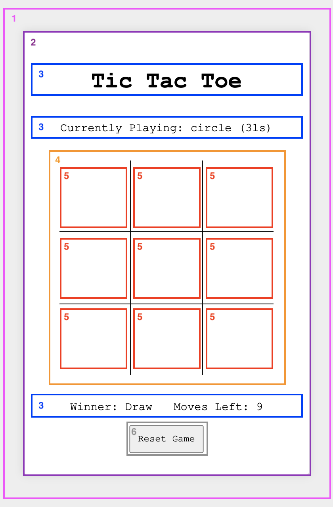
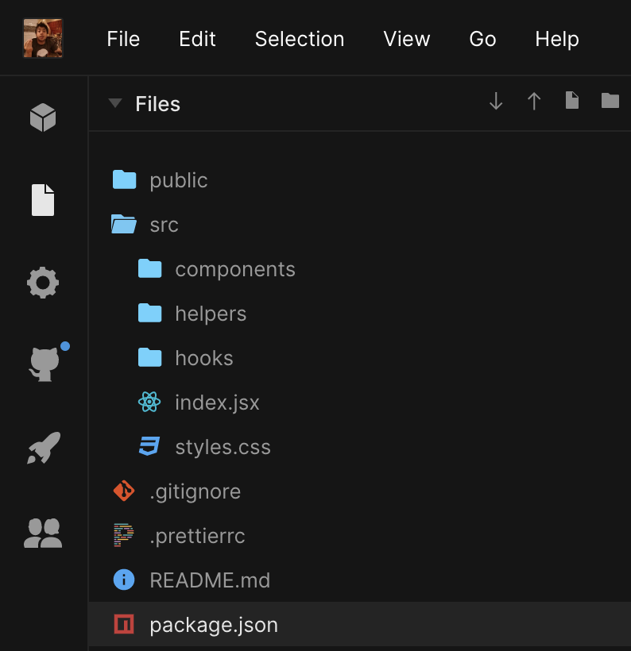
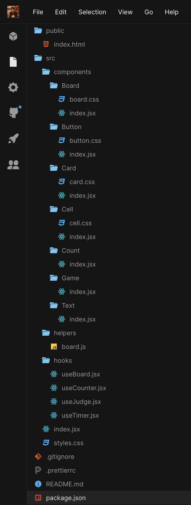

# React By Example: Tic Tac Toe Game

<p align="center">
  <a href="https://egbnq.csb.app">
    
  </a>
</p>

## Table of Contents

- [Hello World](#hello-world)
  - [Declarative](#declarative)
  - [Component-Based](#component-based)
  - [Learn Once, Write Everywhere](#learn-once-write-everywhere)
- [Thinking in React](#thinking-in-react)
- [Game Structure Prototype](#game-structure-prototype)
  - [The Game Component](#the-game-component)
  - [The Text Component](#the-text-component)
  - [The Card Component](#the-card-component)
  - [The Button Component](#the-button-component)
  - [The Board Component](#the-board-component)
  - [The Cell Component](#the-cell-component)
- [State and Application Logic](#state-and-application-logic)
  - [Managing the Board State](#managing-the-board-state)
  - [Managing the Game Rules](#managing-the-game-rules)
  - [Implementing-the-timer](#implementing-the-timer)
- [Optimizations](#optimizations)
- [Code Organization](#code-organization)
- [References](#references)

## Hello World

[React.js](https://reactjs.org/) follows three basic foundational values:

1. Declarative;
2. Component-based;
3. Learn once, write anywheree.

### Declarative

```jsx
import ReactDOM from "react-dom"

import "./styles.css"

const app = <h1>Hello World</h1>

ReactDOM.render(app, document.getElementById("root"))
```

The `JSX` is the declarative portion of the lib. It's not really HTML, but rather, an extension of the JS language. You can think of it as being a templating language, and it's how we'll describe UI elements;

### Component-Based

```jsx
import ReactDOM from "react-dom"

import "./styles.css"

function Greeting({ value }) {
  return <div className="Greeting">{value}</div>
}

const app = <Greeting value="Hello World" />

ReactDOM.render(app, document.getElementById("root"))
```

Components are simply JavaScript functions that:

1. Return `JSX` code describing how that component should look like;
2. Can optionally receive data via its first argument, called `Props`; Props passed into the component can be used to drive what the current structure of the component should be, e.g., conditionally render portions of the JSX, toggle CSS classes on JSX elements, populate portions of the UI with data, etc...
3. Most components don't hold "internal state", and behave like pure functions, e.g. all the data they need are provided via props, and given the same set of props, we always have the same output. These are known as stateless components. We'll talk about stateful components later on.

### Learn Once, Write Everywhere

React can be written and rendered to differet platforms using different renderers. `ReactDOM` is the engine used to render React apps to HTML, but there are projects that provided renderers for other "environments", here're a few:

1. [React Native](https://reactnative.dev/): Render React code to iOS or Andoid platforms;
2. [React Three Fiber](https://github.com/pmndrs/react-three-fiber): React renderer for [threejs](https://threejs.org/) on the web and react-native;
3. [Ink](https://github.com/vadimdemedes/ink): React renderer for terminal apps.

## Thinking in React

1. Break down your UI/mockup into smaller building blocks that can be implemented as React components;
1. Compose them together to build the final prototype matching the mockup;
1. Add application logic (usually, bettere placed in the root component).

Learn more about the Thinking in React mindset [here](https://reactjs.org/docs/thinking-in-react.html).

<p align="center">
  
</p>

## Game Structure Prototype

The pseudo code below gives an idea of how we can structure our app in terms of the component abstractions we just went over.

```jsx
1: <Game>:
  2: <Card>
    3: <Text variant="title" value="Tic Tac Toe" />
    3: <Text value="Currently Playing: circle (6s)" />

    4: <Board>
      5: <Cell />
      5: <Cell />
      5: <Cell />

      5: <Cell />
      5: <Cell />
      5: <Cell />

      5: <Cell />
      5: <Cell />
      5: <Cell />
    </Board>

    3: <Text value="Winner: N/A. Moves Left: 4" />
    6: <Button>Reset Game</Butotn>
  </Card>
```

### The Game Component

What do we know about this component?

- [ ] It’s the root of our application
- [ ] Will be responsible for encapsulating the state and application logic of our app and pass data down to other components via their props
- [ ] But for now… it will simply encapsulate all our game structure

<details><summary>Result</summary>
<p>

```jsx
export function Game() {
  return (
    <Card>
      <Text value="Tic Tac Toe" variant="title" />
      <Text value="Currently Playing: circle (4s)" />
      <Board>
        <Cell />
        <Cell />
        <Cell />
        <Cell />
        <Cell />
        <Cell />
        <Cell />
        <Cell />
        <Cell />
      </Board>
      <Text value="Winner: N/A. Moves Left: 9" />
      <Button>Reset Game</Button>
    </Card>
  )
}
```

</p>
</details>

### The Text Component

- [ ] Should support two styles:
  - [ ] One to be used for the “Tic Tac Toe” title
  - [ ] Another for the rest of the text used in the App

<details><summary>Result</summary>
<p>

```jsx
export function Text({ value, variant }) {
  const Tag = variant === "title" ? "h1" : "p"
  return <Tag>{value}</Tag>
}
```

</p>
</details>

### The Card Component

- [ ] It will define the boundaries of our app, e.g. container holding the app title, match info, game board, game statistics, etc...
- [ ] Gets scaled up a bit when the game is over

<details><summary>Result</summary>
<p>

```jsx
import classnames from "classnames"

import "./card.css"

export function Card({ children, zoomed = false }) {
  const css = classnames("Card", {
    zoomed,
  })

  return <div className={css}>{children}</div>
}
```

</p>
</details>

### The Button Component

- [ ] Should decorate the native button element with our custom style
- [ ] Should still provide all the built-in capabilities of a button

<details><summary>Result</summary>
<p>

```jsx
import "./button.css"

export function Button({ children, onClick, ...props }) {
  return (
    <button {...props} className="Button" onClick={onClick}>
      {children}
    </button>
  )
}
```

</p>
</details>

### The Board Component

What do we know about this component?

- [ ] It needs to render the board
- [ ] It will take cell elements as its children elements

<details><summary>Result</summary>
<p>

```jsx
import "./board.css"

export function Board({ children }) {
  return <div className="Board">{children}</div>
}
```

</p>
</details>

### The Cell Component

What do we know about this component?

- [ ] Should be clickable
- [ ] Should support keyboard navigation
- [ ] Can be empty
- [ ] Can be taken by a player, either a “circle” or a “cross”
- [ ] Is highlighted in bold red when the cell belongs to a winning move
- [ ] Should be disabled when:
  1. [ ] taken
  2. [ ] highlighted (belongs to a winning move)
  3. [ ] the game is over
- [ ] Should allow for a callback to be passed in so it is executed when the cell is clicked, informing the position of the cell within the board

<details><summary>Result</summary>
<p>

```jsx
import { useContext } from "react"
import classnames from "classnames"

import "./cell.css"

export function Cell({ row, col, takenBy, onTake, highlighted, gameOver }) {
  const css = classnames("Cell", {
    [takenBy]: takenBy,
    highlighted,
  })

  return (
    <button
      className={css}
      disabled={takenBy || highlighted || gameOver}
      onClick={() => onTake(row, col)}
    />
  )
}
```

</p>
</details>

## State and Application Logic

So far, eventhough we have something that visually matches our mockup, our app does not do much. Now it's time to implement state management and application logic! Here's what we need:

1. Track and manage the state of the board based on user interactions;
2. Implement the game rules so the user can only do what's allowed as the game progresses;
3. We'll also need a timer, so we can tell how long a match took.

In order to achieve these requirements, we'll have to learn a little bit about [state management](https://reactjs.org/docs/hooks-state.html), [component-lifecycle](https://reactjs.org/docs/hooks-effect.html), and application logic abstraction. To see these concepts in action, let's go ahead and implement a simple `Counter` app.

<details><summary>Result</summary>
<p>

```jsx
import { useState } from "react"

export function useCounter(initialCount = 0) {
  const [count, setCount] = useState(initialCount)
  const reset = () => setCount(initialCount)
  const decrement = () => setCount((count) => count - 1)
  const increment = () => setCount((count) => count + 1)

  return {
    count,
    decrement,
    increment,
    reset,
  }
}

export function Counter({ initialCount = 0 }) {
  const { count, decrement, increment, reset } = useCounter(initialCount)

  return (
    <div>
      {count}
      <button onClick={decrement}>-1</button>
      <button onClick={increment}>+1</button>
      <button onClick={reset}>Reset</button>
    </div>
  )
}
```

</p>
</details>

Make sure you are aware of the [Rule of Hooks](https://reactjs.org/docs/hooks-rules.html) before moving forward :)

### Managing the Board State

```js
// prettier-ignore
const { rows, take, reset } = useBoard([
  [null, null, null],
  [null, null, null],
  [null, null, null],
])
```

We'll be implementing a new custom hook `useBoard` that will allow us to:

- [ ] Dynamically initialize the board using a data structure (rather than hardcoding cells like we've been doing)
- [ ] Update the board state as users make moves
- [ ] Reset the board when the `Reset Game` button is clicked

<details><summary>Result</summary>
<p>

```jsx
import { useState } from "react"

export function useBoard(initialState) {
  const [board, setBoard] = useState(initialState)
  const reset = () => setBoard(initialState)
  const take = (row, col, takenBy) => {
    board[row][col] = takenBy
    setBoard([...board])
  }

  return {
    board,
    take,
    reset,
  }
}
```

</p>
</details>

### Managing the Game Rules

```js
// prettier-ignore
const {
  currentPlayer,
  nextPlayer,
  winner,
  isGameOver,
  movesLeft,
} = useJudge(boardState)
```

The `useJudge` custom hook should provide an abstraction of a game judge, encapsulating logic to implement the game rules. Its API should allow us to:

- [ ] Access the current player (either "circle" or "cross")
- [ ] Switch turns as players make moves
- [ ] Compute a winner if one exists
- [ ] Check if the game is over
- [ ] Check how many moves are left

<details><summary>Result</summary>
<p>

```jsx
import { useState } from "react"
import { countMovesLeft, findWinner } from "../helpers"

export function useJudge(board) {
  const [currentPlayer, setCurrentPlayer] = useState("circle")
  const movesLeft = () => countMovesLeft(board)
  const noMovesLeft = movesLeft === 0
  const winner = movesLeft > 4 ? null : findWinner(board)
  const isGameOver = winner || noMovesLeft
  const nextPlayer = () => {
    const nextPlayer = currentPlayer === "circle" ? "cross" : "circle"

    setCurrentPlayer(nextPlayer)
  }

  return {
    currentPlayer,
    nextPlayer,
    winner,
    isGameOver,
    movesLeft,
  }
}
```

</p>
</details>

### Implementing the Timer

```js
// prettier-ignore
const { count, reset, stop } = useTimer()
```

The `useTimer` custom hook will be responsible for managing the game timer, and will allow us to:

- [ ] Access the current timer state
- [ ] Reset the timer when the game is reset
- [ ] Stop the timer when the game is over

<details><summary>Result</summary>
<p>

```jsx
import { useEffect, useRef } from "react"
import { useCounter } from "./useCounter"

export function useTimer() {
  const timer = useRef()
  const { count, increment, reset: resetCounter } = useCounter()
  const stop = () => clearInterval(timer.current)
  const reset = () => {
    resetCounter()
    timer.current = setInterval(increment, 1000)
  }

  useEffect(() => {
    timer.current = setInterval(increment, 1000)
    return stop
  })

  return {
    count,
    reset,
    stop,
  }
}
```

</p>
</details>

## Optimizations

- [ ] Skipping unnecessary side-effects in the `useTimer` hook with [useCallback](https://reactjs.org/docs/hooks-reference.html#usecallback) hook. As a rule of thumb, make sure you memoize every exposed API from any custom hooks you create, that will allow clients of your hook to optimize their code when needed without extra work on their side
- [ ] Skipping expensive computation in `useJudge` hook with [useMemo](https://reactjs.org/docs/hooks-reference.html#usememo)
- [ ] Skipping unnecessary renderings with [React.memo](https://reactjs.org/docs/react-api.html#reactmemo)
- [ ] Avoid prop drilling with the [context API](https://reactjs.org/docs/hooks-reference.html#usecontext) (`<GameContext.Provider />` + `useContext`)
- [ ] [CSS Modules](https://github.com/css-modules/css-modules) to avoid CSS leaking. [babel-plugin-react-css-modules](https://github.com/gajus/babel-plugin-react-css-modules) makes it even simpler to work with CSS modules in React.

## Code Organization

React does not enforce any particular project structure, this is pretty much up to us. With that said, here's one I like to follow:

<p align="center">
  
</p>

<p align="center">
  
</p>

## References

1. [React Official Website](https://reactjs.org/)
1. [React Docs: Main Concepts Guide](https://reactjs.org/docs/hello-world.html)
1. [React Docs: JSX in Depth](https://reactjs.org/docs/jsx-in-depth.html)
1. [React Docs: Introducing Hooks](https://reactjs.org/docs/hooks-intro.html)
1. [React Docs: Advanced Guides](https://reactjs.org/docs/accessibility.html)
1. [Talk: Introducing Hooks, by Dan Abramov](https://youtu.be/dpw9EHDh2bM)
1. [Free Egghead Course: The Beginner's Guide to React, by Kent C. Dodds](https://egghead.io/courses/the-beginner-s-guide-to-react)
